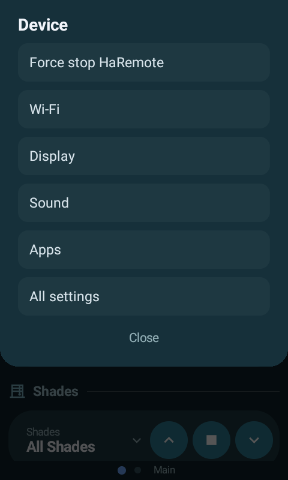

# Astrion Custom — a standalone Home Assistant UI for the Sanytron Astrion HA100

A from-scratch Android app that **replaces** the stock `HaRemote` UI on the
Astrion HA100 remote with a fully custom, extensible interface you control end
to end.

It connects directly to Home Assistant over the standard WebSocket API, renders
whatever cards and layouts you define, and maps the remote's physical buttons to
any action you want. Nothing depends on Sanytron's cloud or their HA integration
— only a reachable HA instance and a long-lived token.

> **This is a fork** of [baes-cloud/astrion-dashboard](https://github.com/baes-cloud/astrion-dashboard).
> Jump to **[what this fork changes](#what-this-fork-changes)**.

---

## Screenshots

| Main page | Activity selector | Now playing |
|---|---|---|
|  |  |  |

| Display section | Volume overlay | Mute overlay |
|---|---|---|
|  |  |  |

| Status page | …continued | Settings sheet |
|---|---|---|
|  |  |  |

The layout behind these shots is [`examples/dashboard.yaml`](examples/dashboard.yaml)
— a real, in-use configuration rather than a toy one.

---

## What this fork changes

All additive: the upstream architecture (an open `CardRegistry`, a document-driven
layout) is unchanged. Each item below landed as its own commit.

| Area | Change |
|---|---|
| **New cards** | `separator`, `bubble_select`, `shade_control`, `bubble_climate`, `conditional` |
| **Changed cards** | `media_player` transport rework + auto-collapse, `monitor` attribute rows, `button_grid` selected state, `fan` tile restyle |
| **Hotkeys** | corrected HA100 keycode map, `scroll_to` a section, `open_on` auto-opens a selector, `action: sync` |
| **Configuration** | credentials out of the APK, a setup web server, layout sync from Home Assistant, swipe-up info panel |
| **Voice** | the VOICE key streams the mic to an endpoint you configure; ends on silence |
| **UI** | transient volume / mute overlay, voice indicator |
| **Build** | signed, R8-minified release (16 MB → 1.3 MB), bounded Gradle heap |
| **Performance** | filtered entity subscription, per-key entity observation, card-level pass |

**→ [docs/FORK_ADDITIONS.md](docs/FORK_ADDITIONS.md)** documents every new card
and config option with JSON examples, and reports the performance work with the
on-device measurements behind it — including one pass that measurably *didn't*
help.

---

## Install

### 1. Get at the USB-C port

The HA100's USB-C port hides under the plastic strip on the bottom edge.
**Undo the two small screws** and lift the strip off:


### 2. Enable developer options

On the remote: **Settings → About → tap Build number 7×**, then
**Settings → Developer options → USB debugging**. With a cable connected:

```sh
adb devices        # the remote should be listed
```

Optionally switch to wireless adb so the cable isn't needed again. Note this does
**not** survive a reboot — redo it over USB if the remote restarts:

```sh
adb tcpip 5555
adb connect <remote-ip>:5555
```

### 3. Install the app

Either works; the difference only matters later. The prebuilt APK renders every
card type this fork ships, and layouts are data, so you can go a long way without
a toolchain — but **adding a brand-new card type means compiling** (see
[Add a new native card type](#add-a-new-native-card-type-the-whole-point)).

**Option A — prebuilt release** (signed, minified, ~1.4 MB):

```sh
adb install releases/astrion-custom-0.23.0.apk
```

**Option B — build from source.** You need:

| | |
|---|---|
| JDK | **17** — `JAVA_HOME` must point at it |
| Android SDK | platform **34**, build-tools **34.0.0**, platform-tools |
| Gradle | none, use the bundled wrapper (`./gradlew`) |
| RAM | ~4 GB free; `gradle.properties` caps the heaps for smaller machines |

```sh
cp secrets.properties.example secrets.properties   # may stay blank — see step 5
./gradlew assembleDebug
adb install -r app/build/outputs/apk/debug/app-debug.apk
```

For a **release** build (strongly preferred — debug builds are noticeably slower
on this SoC), create a keystore and add it to `secrets.properties`:

```sh
keytool -genkeypair -keystore release.jks -alias astrion \
  -keyalg RSA -keysize 2048 -validity 10950
```

```properties
releaseKeystore=/path/to/release.jks
releaseKeystorePassword=…
releaseKeyAlias=astrion
releaseKeyPassword=…
```

```sh
./gradlew assembleRelease
adb install -r app/build/outputs/apk/release/app-release.apk
```

> **Keep that key forever.** Android only allows in-place updates when the
> signature matches; a different key means uninstalling first.

### 4. Make it the launcher

The stock `HaRemote` app is a system app **and the device's launcher**. Set this
app as home instead — that single preference is also the biggest battery win
available on this hardware:

```sh
adb shell cmd package set-home-activity com.custom.astrion/.MainActivity
```

`MainActivity` already declares `CATEGORY_HOME`, so it is eligible; the command
just makes it preferred. To go back:

```sh
adb shell cmd package set-home-activity com.aiks.HaRemote/.boot.RemoteApp
```

**Why this matters beyond convenience.** The stock app holds a
`PARTIAL_WAKE_LOCK` for as long as it runs — measured here as one unbroken
68-hour hold, meaning the device had never entered deep sleep since boot. With
this app preferred as home the stock app **never starts**: its `boot.RemoteApp`
component is its launcher entry, not an independent boot hook. Verified across a
reboot — the preference survives, Home goes straight to the dashboard, and the
system reports no wake locks held.

> **Do not disable the stock launcher.** It is tempting to go further and run
> `pm disable-user com.aiks.HaRemote`. **Don't.** Disabling the launcher leaves
> the HA100 in a permanent bootloop, and on this hardware safe mode, recovery
> mode and factory reset are all unreachable once that happens — the only way
> back is BROM/preloader mode with SP Flash Tool, signed MediaTek USB drivers
> and firmware from the vendor. At least one owner has bricked a unit this way.
> Setting the home-activity preference reaches the same result, disables
> nothing, and reverts with one command.

Related: network adb does **not** survive a reboot on this device.
`adb tcpip 5555` sets only the runtime property, and `persist.adb.tcp.port` is
ignored by this build, so after every reboot you need USB again. Treat anything
boot-related as a one-shot test and keep the cable to hand.

#### Prefer to keep the stock launcher?

Bind a hardware key to open this app instead, with
[Key Mapper](https://github.com/keymapperorg/KeyMapper) (FOSS build): trigger on
the Home key (it reports as **`F1`** here), action *Open app → Astrion Custom*,
and constrain it to *HaRemote is in foreground* — without that constraint the
Home key is swallowed everywhere, including inside this app where it is bound to
your own hotkey.


### 5. Optional: keys that work with the screen off

By default, the press that wakes the screen is **swallowed** — Android's
`PhoneWindowManager` consumes it to light the display, and only your *second*
press does anything. The input bridge fixes that: with it running, the first
press wakes the screen **and** runs its action.

Start it over adb:

```sh
adb shell "CLASSPATH=$(adb shell pm path com.custom.astrion | cut -d: -f2) \
  app_process /system/bin com.custom.astrion.bridge.InputBridge"
```

You do not need to compose that by hand — the app shows the exact command, with
this install's apk path already filled in, in the swipe-down sheet under
**Screen-off keys**. Tap it to copy. The path changes on every reinstall, which
is why it is resolved at runtime rather than written down.

The sheet also shows whether the bridge is currently `connected` or
`not running`.

#### Restarting it after a reboot

**The bridge does not survive a reboot, and cannot.** Reading `/dev/input`
requires group 1004 (`input`) and the `input_device` SELinux label; nothing on
the device can grant an app either, so it has to be started from a shell every
time. On the HA100 network adb does not survive a reboot either, so:

```sh
# 1. plug in USB
adb tcpip 5555                       # re-enable network adb (runtime only)
adb connect <remote-ip>:5555         # optional, if you prefer working wirelessly
# 2. start the bridge (or copy the command from the swipe-down sheet)
adb shell "CLASSPATH=$(adb shell pm path com.custom.astrion | cut -d: -f2) \
  app_process /system/bin com.custom.astrion.bridge.InputBridge"
```

Leave the shell open, or background it — when that process exits, screen-off
keys stop and everything reverts to normal two-press behaviour.

> **Nothing breaks without it.** The feature is strictly additive: the app
> retries the connection quietly and treats a missing bridge as the normal case,
> not an error. Screen-off presses run the *same* actions as screen-on ones,
> because the bridge feeds the same handler table rather than a parallel map.

> **Why not just sign the app as system?** Because it would not work.
> `sharedUserId=android.uid.system` puts the app in the `system_app` SELinux
> domain, which is not in group 1004 and has no `input_device` access either —
> it would install, run as system, and still be denied. An app cannot escalate
> to fix that: `su` refuses callers that are not already root or shell.

### 6. Reach system settings without a launcher

With this app as home there is no stock launcher UI, so it carries its own way
into Android's settings: **swipe down on the status strip**.


Configured under `gestures.swipe_down` (see
[docs/FORK_ADDITIONS.md](docs/FORK_ADDITIONS.md#screen-edge-gestures)). The
App info row is worth including for any package you may need to Force stop or
re-Enable later — it is also the way back if a package is ever disabled.

### 7. Point the app at Home Assistant

On first launch the app has no credentials and shows its own setup address:


Open `http://<remote-ip>:8099` in any browser on the LAN and paste your Home
Assistant URL and a **long-lived access token** (HA → profile → Security).

Credentials are stored in the app's private storage — **not** in the APK, and not
on `/sdcard` where any app with storage permission could read them. The setup
server stops as soon as they're saved; reopen it later from the swipe-up info
panel.

### 8. Add your layout

The app fetches a JSON layout from Home Assistant over the connection you just
configured. **This fork ships `REMOTE_PATH = "/api/astrion_dashboard"`**, so the
path of least resistance — and the only one that needs no rebuild if you're on
the prebuilt APK — is to install [the companion component](#the-home-assistant-portion-optional-but-recommended)
below and author the layout in YAML.

If you'd rather serve a plain JSON file from HA's `www/` folder (`/local/…`)
instead, that means changing `DashboardLoader.REMOTE_PATH` — a code change, so
it only applies if you're building from source.

Sync to the remote any time from the **swipe-up panel → Sync**, or a hotkey with
`"action": "sync"`. The layout is cached on the device, so the remote still works
if HA is unreachable.

---

## The Home Assistant portion (optional but recommended)

[`homeassistant/custom_components/astrion_dashboard/`](homeassistant/custom_components/astrion_dashboard)
lets you author the layout in **YAML** — comments, HA-native, `!include`-able —
and serves it to the remote as JSON. No generated file to fall out of sync, and
unlike `/local/` the endpoint requires authentication.

1. Copy the component into your HA config:

   ```sh
   cp -r homeassistant/custom_components/astrion_dashboard /config/custom_components/
   ```

2. Put your layout at `/config/astrion/dashboard.yaml` — start from
   [`examples/dashboard.yaml`](examples/dashboard.yaml).

3. Add to `configuration.yaml`, then restart HA:

   ```yaml
   astrion_dashboard:
     # path: astrion/dashboard.yaml   # optional, this is the default
   ```

4. Verify:

   ```sh
   curl -H "Authorization: Bearer <token>" http://<ha>:8123/api/astrion_dashboard
   ```

This fork already ships `REMOTE_PATH = "/api/astrion_dashboard"`, so nothing else
is needed. Editing the layout then requires no adb and no rebuild: edit the YAML,
press Sync.

---

## Add a new native card type (the whole point)

> **This is the one thing that needs you to build the app yourself.** A card
> *type* is Kotlin, so it has to be compiled in — the prebuilt APK in
> `releases/` can only render the types it already knows about. Follow
> [build from source](#3-install-the-app) (Option B), then reinstall with
> `adb install -r`.
>
> Everything else is data, not code: adding or rearranging card *instances*,
> pages, sections and hotkeys is a layout edit plus **Sync** — no rebuild, no
> adb. Design cards to read plenty of `options` up front and most future tweaks
> stay on the YAML side.

1. Create a renderer in `app/src/main/java/com/custom/astrion/cards/impl/`:

   ```kotlin
   class ThermostatCard : CardRenderer {
       override val type = "thermostat"

       @Composable
       override fun Render(config: CardConfig, ctx: CardContext) {
           val entityId = config.string("entity_id") ?: return
           val e = ctx.entities[entityId]     // per-key read
           Text(e?.state ?: "—")
       }
   }
   ```

2. Register it in `AstrionApp.onCreate()`: `CardRegistry.register(ThermostatCard())`
3. Reference its `type` from your layout.

An unregistered type shows an inline warning rather than vanishing silently.

> Read `ctx.entities` **by key**. Iterating it (`values` / `keys` / `forEach`)
> inside composition subscribes to every entity and undoes this fork's
> recomposition work — see
> [docs/FORK_ADDITIONS.md](docs/FORK_ADDITIONS.md#per-key-entity-observation).

---

## Physical buttons

The HA100 keycodes live in `input/HardwareKeys.kt`; bindings come from the
layout's `hotkeys` list, so most changes need no rebuild. The dedicated
LIGHT / CURTAIN / SCENE / AC and CUSTOM_1..4 keys can each fire a service, jump
to a page, scroll to a section, or run a built-in action.

### VOICE

`action: voice` turns the VOICE key into press-and-talk: it streams the
microphone to the endpoint named by `voice.path` and ends itself on ~1.2 s of
silence. The remote makes no decision about what the audio means — that's the
server's job. Needs the **microphone permission**, which the app requests on
first launch; if you skipped the prompt:

```
adb shell pm grant com.custom.astrion android.permission.RECORD_AUDIO
```

Note the HA100's VOICE key reports an instant press+release rather than a hold,
so hold-to-talk isn't possible on this hardware — see
[docs/FORK_ADDITIONS.md](docs/FORK_ADDITIONS.md#voice).

**Something has to receive that audio.** Any endpoint taking a chunked PCM16
body will do. If you want the words to reach **Siri on an Apple TV**, that is
what [appletv-siri-voice](https://github.com/marcusadolfsson/appletv-siri-voice)
is for — a Home Assistant integration that makes HA appear to an Apple TV as a
HomeKit remote, so voice from this key lands on Siri exactly as it would from
the physical Siri Remote. Point `voice.path` at the Apple TV's URL:

```yaml
voice:
  path: /api/appletv_siri/audio/living_room
```

---

## Project map

| Path | Role |
|------|------|
| `ha/HaClient.kt` | HA WebSocket client (auth, filtered `subscribe_entities`, `call_service`, ping) |
| `cards/Card.kt` | `CardRenderer` + `CardRegistry` + the `@Stable` `CardContext` |
| `cards/impl/*` | Card types — upstream's plus this fork's five |
| `config/DashboardLoader.kt` | Fetches the layout from HA, caches it, falls back to the compiled default |
| `config/ConnectionConfig.kt` | Credentials in app-private storage |
| `config/ConfigServer.kt` | The `:8099` setup web form |
| `config/EntityRefs.kt` | Works out which entities the layout uses, for the filtered subscription |
| `ui/Dashboard.kt` | Pager, cards, info panel, volume overlay |
| `input/HardwareKeys.kt` | HA100 keycode map + tap/long-press router |
| `homeassistant/custom_components/astrion_dashboard/` | Serves the YAML layout as JSON |

`COMMUNITY.md` has upstream's full card reference and config schema;
`ARCHITECTURE.md` explains how the stock app works and why this design follows.

---

## Status / caveats

* Built for the **Astrion HA100** — 480×800, Android 8.1 (API 27, `minSdk` 26),
  1 GB RAM, MT6580 + Mali-400. Keep custom cards light.
* The stock app stays installed as the launcher; this runs alongside it.
* Upstream ships **no LICENSE file**, so no redistribution rights are granted
  beyond what GitHub's ToS allows for forks.
