# Astrion Custom — a standalone Home Assistant UI for the Sanytron Astrion HA100

A from-scratch Android app that **replaces** the stock `HaRemote` UI on the
Astrion HA100 remote with a fully custom, extensible interface you control end
to end.

It connects directly to Home Assistant over the standard WebSocket API, renders
whatever cards and layouts you define, and maps the remote's physical buttons to
any action you want. Nothing depends on Sanytron's cloud or their HA integration
— only a reachable HA instance and a long-lived token.

> **This is a fork** of [baes-cloud/astrion-dashboard](https://github.com/baes-cloud/astrion-dashboard).
> Jump to **[what this fork changes](#what-this-fork-changes)**.

---

## Screenshots

| Main page | Activity selector | Now playing |
|---|---|---|
| 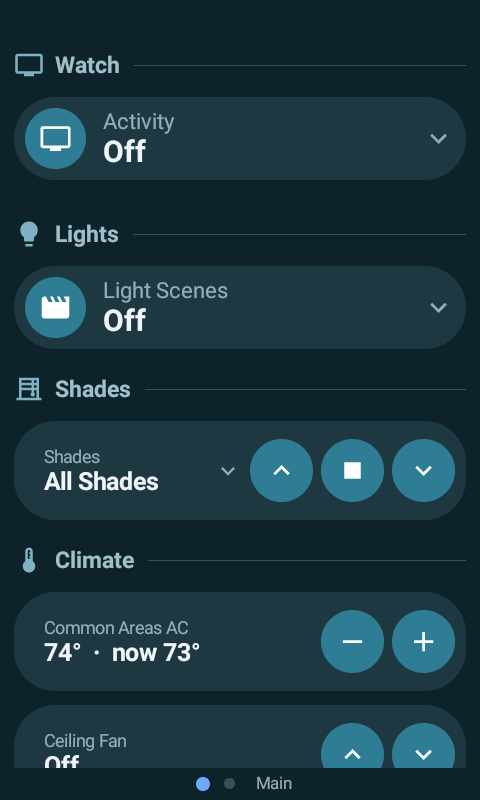 | 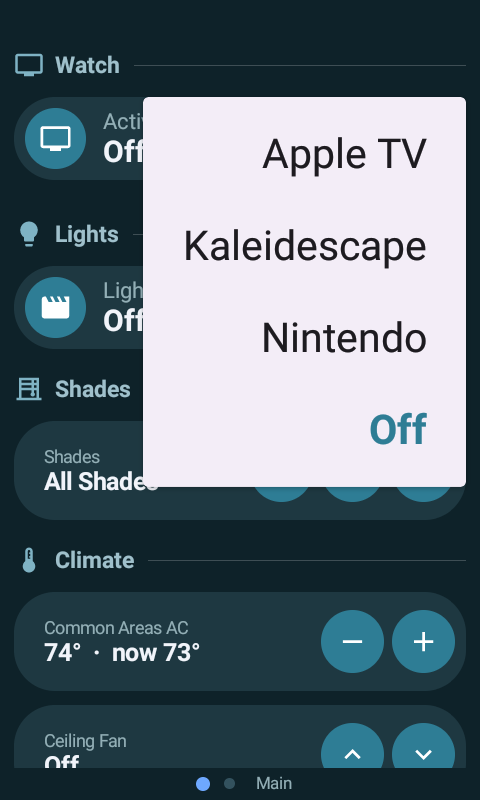 | 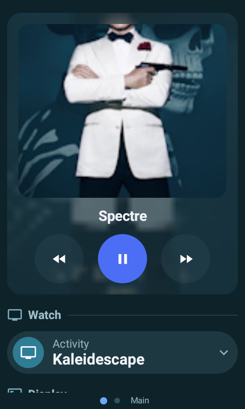 |

| Display section | Volume overlay | Mute overlay |
|---|---|---|
| 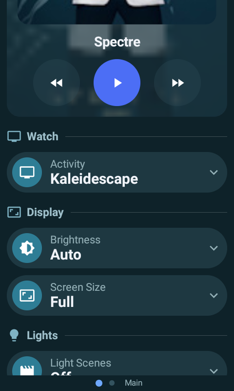 | 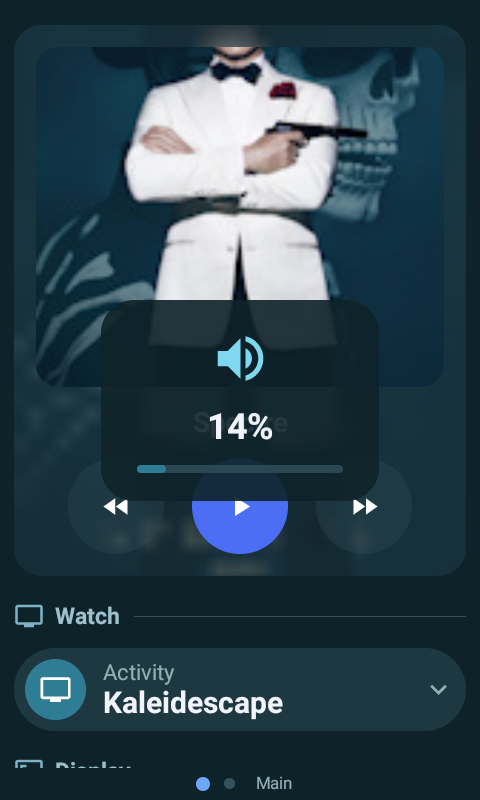 |  |

| Status page | …continued |
|---|---|
| 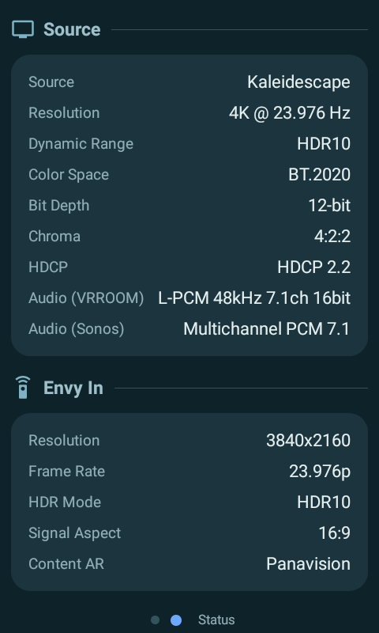 | 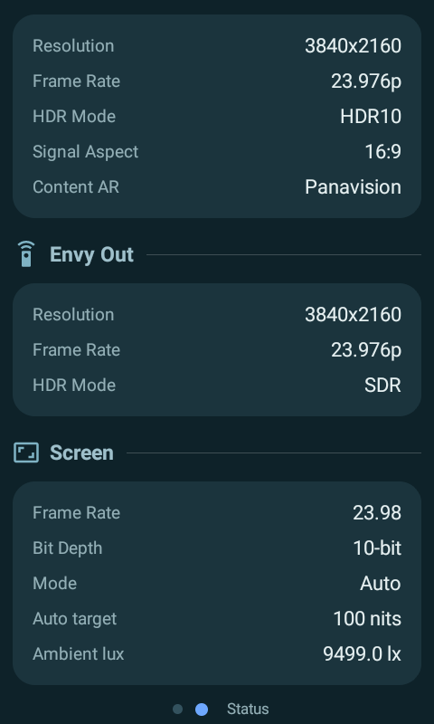 |

The layout behind these shots is [`examples/dashboard.yaml`](examples/dashboard.yaml)
— a real, in-use configuration rather than a toy one.

---

## What this fork changes

All additive: the upstream architecture (an open `CardRegistry`, a document-driven
layout) is unchanged. Each item below landed as its own commit.

| Area | Change |
|---|---|
| **New cards** | `separator`, `bubble_select`, `shade_control`, `bubble_climate`, `conditional` |
| **Changed cards** | `media_player` transport rework + auto-collapse, `monitor` attribute rows, `button_grid` selected state, `fan` tile restyle |
| **Hotkeys** | corrected HA100 keycode map, `scroll_to` a section, `open_on` auto-opens a selector, `action: sync` |
| **Configuration** | credentials out of the APK, a setup web server, layout sync from Home Assistant, swipe-up info panel |
| **Voice** | the VOICE key streams the mic to an endpoint you configure; ends on silence |
| **UI** | transient volume / mute overlay, voice indicator |
| **Build** | signed, R8-minified release (16 MB → 1.3 MB), bounded Gradle heap |
| **Performance** | filtered entity subscription, per-key entity observation, card-level pass |

**→ [docs/FORK_ADDITIONS.md](docs/FORK_ADDITIONS.md)** documents every new card
and config option with JSON examples, and reports the performance work with the
on-device measurements behind it — including one pass that measurably *didn't*
help.

---

## Install

### 1. Get at the USB-C port

The HA100's USB-C port hides under the plastic strip on the bottom edge.
**Undo the two small screws** and lift the strip off:

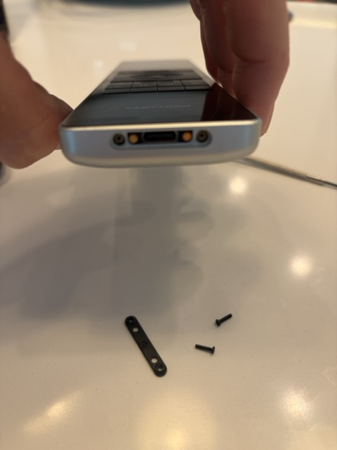

### 2. Enable developer options

On the remote: **Settings → About → tap Build number 7×**, then
**Settings → Developer options → USB debugging**. With a cable connected:

```sh
adb devices        # the remote should be listed
```

Optionally switch to wireless adb so the cable isn't needed again. Note this does
**not** survive a reboot — redo it over USB if the remote restarts:

```sh
adb tcpip 5555
adb connect <remote-ip>:5555
```

### 3. Install the app

Either works; the difference only matters later. The prebuilt APK renders every
card type this fork ships, and layouts are data, so you can go a long way without
a toolchain — but **adding a brand-new card type means compiling** (see
[Add a new native card type](#add-a-new-native-card-type-the-whole-point)).

**Option A — prebuilt release** (signed, minified, ~1.4 MB):

```sh
adb install releases/astrion-custom-0.13.1.apk
```

**Option B — build from source.** You need:

| | |
|---|---|
| JDK | **17** — `JAVA_HOME` must point at it |
| Android SDK | platform **34**, build-tools **34.0.0**, platform-tools |
| Gradle | none, use the bundled wrapper (`./gradlew`) |
| RAM | ~4 GB free; `gradle.properties` caps the heaps for smaller machines |

```sh
cp secrets.properties.example secrets.properties   # may stay blank — see step 5
./gradlew assembleDebug
adb install -r app/build/outputs/apk/debug/app-debug.apk
```

For a **release** build (strongly preferred — debug builds are noticeably slower
on this SoC), create a keystore and add it to `secrets.properties`:

```sh
keytool -genkeypair -keystore release.jks -alias astrion \
  -keyalg RSA -keysize 2048 -validity 10950
```

```properties
releaseKeystore=/path/to/release.jks
releaseKeystorePassword=…
releaseKeyAlias=astrion
releaseKeyPassword=…
```

```sh
./gradlew assembleRelease
adb install -r app/build/outputs/apk/release/app-release.apk
```

> **Keep that key forever.** Android only allows in-place updates when the
> signature matches; a different key means uninstalling first.

### 4. Launch it with Key Mapper

The stock `HaRemote` app is a **system app and the device's launcher** — don't
try to replace it, the firmware will relaunch it. Instead bind a hardware key to
open this app.

Install [Key Mapper](https://github.com/keymapperorg/KeyMapper) (FOSS build):

```sh
adb install keymapper.apk
```

Enable its accessibility service, then create one key map:

* **Trigger** — the Home key (it reports as **`F1`** on this hardware)
* **Action** — Open app → *Astrion Custom*
* **Constraint** — *HaRemote is in foreground*

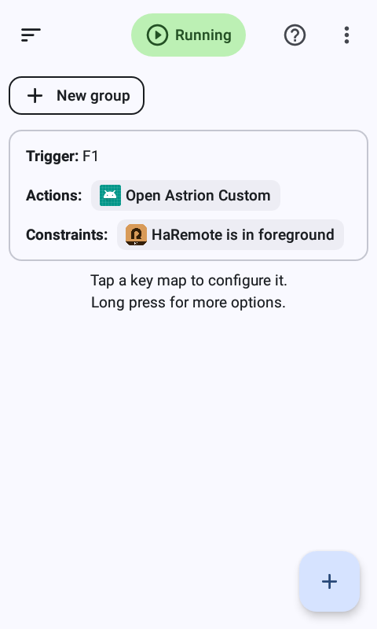

The constraint matters: without it the Home key is swallowed everywhere,
including inside this app, where it's bound to your own hotkey.

### 5. Turn the stock dashboard into a doorway

Since the stock app is only a gate now, strip its Home Assistant dashboard down
to a single card telling you what to press:

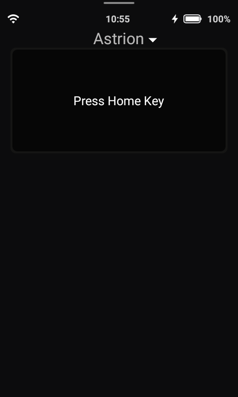

> The stock app renders **only** its own `custom:aiks-*` card types — a plain
> `markdown` card makes it show *"View is empty"*. Use an `aiks-scene-card`
> pointed at a no-op script (a script with an empty `sequence`).

### 6. Point the app at Home Assistant

On first launch the app has no credentials and shows its own setup address:

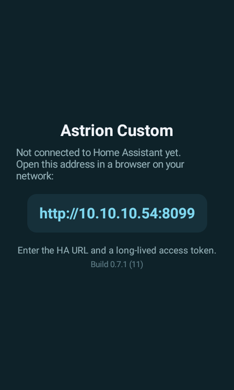

Open `http://<remote-ip>:8099` in any browser on the LAN and paste your Home
Assistant URL and a **long-lived access token** (HA → profile → Security).

Credentials are stored in the app's private storage — **not** in the APK, and not
on `/sdcard` where any app with storage permission could read them. The setup
server stops as soon as they're saved; reopen it later from the swipe-up info
panel.

### 7. Add your layout

The app fetches a JSON layout from Home Assistant over the connection you just
configured. **This fork ships `REMOTE_PATH = "/api/astrion_dashboard"`**, so the
path of least resistance — and the only one that needs no rebuild if you're on
the prebuilt APK — is to install [the companion component](#the-home-assistant-portion-optional-but-recommended)
below and author the layout in YAML.

If you'd rather serve a plain JSON file from HA's `www/` folder (`/local/…`)
instead, that means changing `DashboardLoader.REMOTE_PATH` — a code change, so
it only applies if you're building from source.

Sync to the remote any time from the **swipe-up panel → Sync**, or a hotkey with
`"action": "sync"`. The layout is cached on the device, so the remote still works
if HA is unreachable.

---

## The Home Assistant portion (optional but recommended)

[`homeassistant/custom_components/astrion_dashboard/`](homeassistant/custom_components/astrion_dashboard)
lets you author the layout in **YAML** — comments, HA-native, `!include`-able —
and serves it to the remote as JSON. No generated file to fall out of sync, and
unlike `/local/` the endpoint requires authentication.

1. Copy the component into your HA config:

   ```sh
   cp -r homeassistant/custom_components/astrion_dashboard /config/custom_components/
   ```

2. Put your layout at `/config/astrion/dashboard.yaml` — start from
   [`examples/dashboard.yaml`](examples/dashboard.yaml).

3. Add to `configuration.yaml`, then restart HA:

   ```yaml
   astrion_dashboard:
     # path: astrion/dashboard.yaml   # optional, this is the default
   ```

4. Verify:

   ```sh
   curl -H "Authorization: Bearer <token>" http://<ha>:8123/api/astrion_dashboard
   ```

This fork already ships `REMOTE_PATH = "/api/astrion_dashboard"`, so nothing else
is needed. Editing the layout then requires no adb and no rebuild: edit the YAML,
press Sync.

---

## Add a new native card type (the whole point)

> **This is the one thing that needs you to build the app yourself.** A card
> *type* is Kotlin, so it has to be compiled in — the prebuilt APK in
> `releases/` can only render the types it already knows about. Follow
> [build from source](#3-install-the-app) (Option B), then reinstall with
> `adb install -r`.
>
> Everything else is data, not code: adding or rearranging card *instances*,
> pages, sections and hotkeys is a layout edit plus **Sync** — no rebuild, no
> adb. Design cards to read plenty of `options` up front and most future tweaks
> stay on the YAML side.

1. Create a renderer in `app/src/main/java/com/custom/astrion/cards/impl/`:

   ```kotlin
   class ThermostatCard : CardRenderer {
       override val type = "thermostat"

       @Composable
       override fun Render(config: CardConfig, ctx: CardContext) {
           val entityId = config.string("entity_id") ?: return
           val e = ctx.entities[entityId]     // per-key read
           Text(e?.state ?: "—")
       }
   }
   ```

2. Register it in `AstrionApp.onCreate()`: `CardRegistry.register(ThermostatCard())`
3. Reference its `type` from your layout.

An unregistered type shows an inline warning rather than vanishing silently.

> Read `ctx.entities` **by key**. Iterating it (`values` / `keys` / `forEach`)
> inside composition subscribes to every entity and undoes this fork's
> recomposition work — see
> [docs/FORK_ADDITIONS.md](docs/FORK_ADDITIONS.md#per-key-entity-observation).

---

## Physical buttons

The HA100 keycodes live in `input/HardwareKeys.kt`; bindings come from the
layout's `hotkeys` list, so most changes need no rebuild. The dedicated
LIGHT / CURTAIN / SCENE / AC and CUSTOM_1..4 keys can each fire a service, jump
to a page, scroll to a section, or run a built-in action.

### VOICE

`action: voice` turns the VOICE key into press-and-talk: it streams the
microphone to the endpoint named by `voice.path` and ends itself on ~1.2 s of
silence. The remote makes no decision about what the audio means — that's the
server's job. Needs the **microphone permission**, which the app requests on
first launch; if you skipped the prompt:

```
adb shell pm grant com.custom.astrion android.permission.RECORD_AUDIO
```

Note the HA100's VOICE key reports an instant press+release rather than a hold,
so hold-to-talk isn't possible on this hardware — see
[docs/FORK_ADDITIONS.md](docs/FORK_ADDITIONS.md#voice).

---

## Project map

| Path | Role |
|------|------|
| `ha/HaClient.kt` | HA WebSocket client (auth, filtered `subscribe_entities`, `call_service`, ping) |
| `cards/Card.kt` | `CardRenderer` + `CardRegistry` + the `@Stable` `CardContext` |
| `cards/impl/*` | Card types — upstream's plus this fork's five |
| `config/DashboardLoader.kt` | Fetches the layout from HA, caches it, falls back to the compiled default |
| `config/ConnectionConfig.kt` | Credentials in app-private storage |
| `config/ConfigServer.kt` | The `:8099` setup web form |
| `config/EntityRefs.kt` | Works out which entities the layout uses, for the filtered subscription |
| `ui/Dashboard.kt` | Pager, cards, info panel, volume overlay |
| `input/HardwareKeys.kt` | HA100 keycode map + tap/long-press router |
| `homeassistant/custom_components/astrion_dashboard/` | Serves the YAML layout as JSON |

`COMMUNITY.md` has upstream's full card reference and config schema;
`ARCHITECTURE.md` explains how the stock app works and why this design follows.

---

## Status / caveats

* Built for the **Astrion HA100** — 480×800, Android 8.1 (API 27, `minSdk` 26),
  1 GB RAM, MT6580 + Mali-400. Keep custom cards light.
* The stock app stays installed as the launcher; this runs alongside it.
* Upstream ships **no LICENSE file**, so no redistribution rights are granted
  beyond what GitHub's ToS allows for forks.
